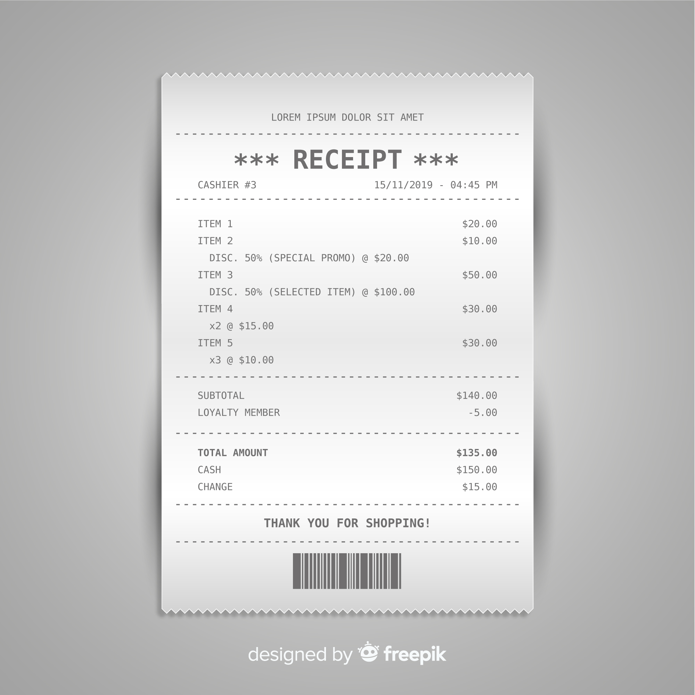

# GCP Vision API OCR: Text Extraction Mini-Project

A Python-based tool leveraging Google Cloud Vision API to extract text from images, demonstrating practical application of cloud AI for document processing. This was undertaken as a one-day mini-project to gain practical experience with Google Cloud Platform's AI services and to develop foundational skills in automated data extraction.

## Table of Contents
- [Objective](#objective)
- [Technologies Used](#technologies-used)
- [How It Works](#how-it-works)
- [Project Structure](#project-structure)
- [Setup and Usage](#setup-and-usage)
- [Sample Output (Image OCR)](#sample-output-image-ocr)
- [Learnings & Key Takeaways](#learnings--key-takeaways)
- [Future Considerations & Next Steps](#future-considerations--next-steps)

## Objective
The primary goals of this mini-project were:
- To learn how to integrate Python applications with the GCP Cloud Vision API for OCR tasks.
- To understand the process of sending image data to a cloud AI service and parsing the response.
- To successfully extract text from various sample image files.
- To gain hands-on experience with GCP authentication (Application Default Credentials) and environment setup.
- To practice troubleshooting common issues like network/proxy configurations when working with cloud services.
- To create a documented, version-controlled project suitable for a portfolio, building a foundational component relevant to automated document processing workflows often found in FinTech and e-commerce industries.

## Technologies Used
- **Cloud Provider:** Google Cloud Platform (GCP)
- **Core Service:** GCP Cloud Vision API (`document_text_detection` method)
- **Language:** Python 3.x
- **Key Python Libraries:**
    - `google-cloud-vision` (official Google Cloud client library)
    - `os` (for operating system interactions, e.g., file paths)
    - `io` (for handling in-memory binary streams)
- **Development Environment:**
    - Python Virtual Environment (`venv` or `gcp1env`)
    - `pip` for package management (`requirements.txt`)
- **Version Control:** Git & GitHub
- **Local Terminal:** PowerShell (for execution and `gcloud` CLI)

## How It Works
The core logic resides in the `ocr_tool.py` script:
1.  **Initialization:** Imports necessary libraries.
2.  **Image Path Handling:** The `extract_text_from_image` function takes a relative path to an image file. It constructs an absolute path to ensure the file can be found regardless of where the script is invoked from.
3.  **Client Instantiation:** An instance of `vision.ImageAnnotatorClient` is created. This client uses Application Default Credentials (ADC) for authentication with GCP.
4.  **Image Loading:** The specified image file is opened in binary read mode (`'rb'`), and its content is read into memory. This binary content is then wrapped in a `vision.Image` object.
5.  **API Request:** The `client.document_text_detection(image=...)` method is called, sending the image data to the Vision API.
6.  **Response Handling:** The script robustly checks the API response for any errors before attempting to parse the text.
    - If successful and text is found, `response.full_text_annotation.text` (which contains the concatenated extracted text) is returned.
7.  **Main Execution:** The `if __name__ == "__main__":` block calls the `extract_text_from_image` function with predefined image paths and prints the results.

## Project Structure
gcp-vision-ocr/
├── .git/ # Git repository data (hidden)
├── gcp1env/ # Python virtual environment (e.g., venv/) - in .gitignore
├── sample_images/ # Directory for sample images
│ ├── receipt1.jpg
│ └── receipt2.jpg
│ └── your_other_image.png # Add your actual image files used for testing
├── .gitignore # Specifies intentionally untracked files for Git
├── ocr_tool.py # The main Python script for OCR
├── requirements.txt # Python package dependencies
└── README.md # This file


## Setup and Usage
To set up and run this project locally:

1.  **Prerequisites:**
    *   A Google Cloud Platform Account with an active project.
    *   The **Cloud Vision API enabled** within your GCP project.
    *   Google Cloud SDK (`gcloud` CLI) installed and configured on your local machine.
    *   Authenticated with Application Default Credentials:
        ```bash
        gcloud auth application-default login
        ```
    *   Python 3.x installed.
    *   Git installed.

2.  **Clone the Repository (if you are viewing this on GitHub):**
    ```bash
    git clone https://github.com/YourUsername/gcp-vision-ocr-demo.git # Replace YourUsername/gcp-vision-ocr-demo with YOUR actual repository URL
    cd gcp-vision-ocr-demo
    ```

3.  **Create and Activate a Python Virtual Environment:**
    ```bash
    # Navigate to the project root directory
    python -m venv gcp1env  # Or your preferred venv name
    # Activate it:
    # Windows PowerShell:
    .\gcp1env\Scripts\activate
    # macOS/Linux or Git Bash on Windows:
    # source gcp1env/bin/activate
    ```

4.  **Install Dependencies:**
    ```bash
    pip install -r requirements.txt
    ```

5.  **Proxy Configuration (If Required):**
    If you are behind a proxy that your system requires for internet access (as was the case in my development environment using a specific phone hotspot setup), set the `HTTPS_PROXY` environment variable in your terminal session *before* running the Python script. The script itself does not contain proxy settings but respects this standard environment variable.
    ```powershell
    # Example for PowerShell:
    $env:HTTPS_PROXY = "http://your_proxy_address.com:PROXY_PORT_NUMBER" # Replace with actual proxy details
    ```

6.  **Prepare Images:**
    *   Ensure you have image files (e.g., `.jpg`, `.png`) in the `sample_images/` directory.

7.  **Run the Script:**
    *   Modify the `relative_image_path_to_process` (and other image path variables if you're testing multiple) at the bottom of `ocr_tool.py` to point to the specific images you want to process within the `sample_images` folder.
    *   Execute from the project root directory:
        ```bash
        python ocr_tool.py
        ```

## Sample Output (Image OCR)
When processing `sample_images/receipt1.jpg`:

<!-- Optional: If you include receipt1.jpg in your repo, you can display it: 
 
-->

The script produces the following output:

```text
--- GCP OCR Text Extractor ---
Attempting to process image: sample_images/receipt1.jpg
Image 'E:\AI Prep\Projects\mini\gcp-vision-ocr\sample_images/receipt1.jpg' loaded successfully.
Sending request to Google Cloud Vision API for text detection...
Text extraction successful!

----- Extracted Text -----
LOREM IPSUM DOLOR SIT AMET
*** RECEIPT ***
CASHIER #3
15/11/2019 - 04:45 PM
ITEM 1
$20.00
ITEM 2
$10.00
DISC. 50% (SPECIAL PROMO) @ $20.00
ITEM 3
$50.00
DISC. 50% (SELECTED ITEM) @ $100.00
ITEM 4
$30.00
x2 @ $15.00
ITEM 5
$30.00
x3 @ $10.00
SUBTOTAL
$140.00
LOYALTY MEMBER
-5.00
TOTAL AMOUNT
CASH
CHANGE
THANK YOU FOR SHOPPING!
designed by freepik
$135.00
$150.00
$15.00
--------------------------
Learnings & Key Takeaways
This mini-project provided valuable hands-on experience in several key areas:

Cloud AI Service Integration: Successfully integrated a Python application with a leading cloud AI service (GCP Cloud Vision API), demonstrating the ability to consume and utilize managed ML capabilities.

GCP Environment & Authentication: Mastered the setup of the Google Cloud SDK (gcloud CLI) and the crucial Application Default Credentials (ADC) mechanism for secure local development and authentication against GCP services.

Problem-Solving (Network & Proxy Configuration):

Challenge: Initially faced network connectivity errors (503 failed to connect, Connection timed out) when attempting to reach the Vision API.

Diagnosis & Solution: Identified that the development environment's internet connection (via a phone hotspot) required a proxy server. Resolved this by correctly configuring the HTTPS_PROXY environment variable in the PowerShell session, enabling the Python client libraries to correctly route traffic through the proxy. This was a critical troubleshooting step highlighting the importance of understanding the network environment.

Practical OCR Application: Gained practical understanding of OCR technology, its application in extracting text from real-world documents (receipts), and observed how image quality can influence extraction accuracy.

Python for Cloud Services: Utilized Python with the google-cloud-vision client library for API interaction, along with os and io modules for robust file handling.

API Interaction Best Practices: Learned to handle API responses, including checking for errors and parsing successful results.

Version Control & Documentation: Employed Git and GitHub for version control and created comprehensive project documentation (README.md) suitable for a portfolio, emphasizing reproducibility and clarity.

Foundation for Document Processing: This project builds a foundational understanding relevant to more complex document automation and data extraction pipelines commonly required in industries like FinTech and e-commerce.

Future Considerations & Next Steps
PDF Text Extraction: While this project focused on images, a next step would be to implement more robust OCR for PDF documents. The initial attempt using the same direct byte-passing method with document_text_detection resulted in a "Bad image data" error for a specific PDF. Future work could involve:

Testing with simpler, text-based PDFs to further diagnose the issue with the current approach.

Exploring alternative Vision API methods more suited for PDFs, such as batch_annotate_files (which can take GCS URIs or inline content with explicit MIME types) or asynchronous processing for larger files.

Web Interface: Develop a simple web interface (e.g., using Flask or Streamlit) to allow users to upload images and view extracted text directly in the browser.

Enhanced Error Handling: Implement more granular error handling and logging within the Python script.

Structured Data Extraction: Move beyond full text extraction to identify and extract specific entities or fields from documents (e.g., total amount, date from a receipt) using regular expressions on the OCR output or exploring GCP's Document AI for more advanced, pre-built parsing capabilities.