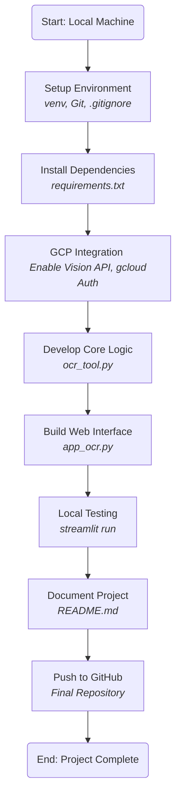
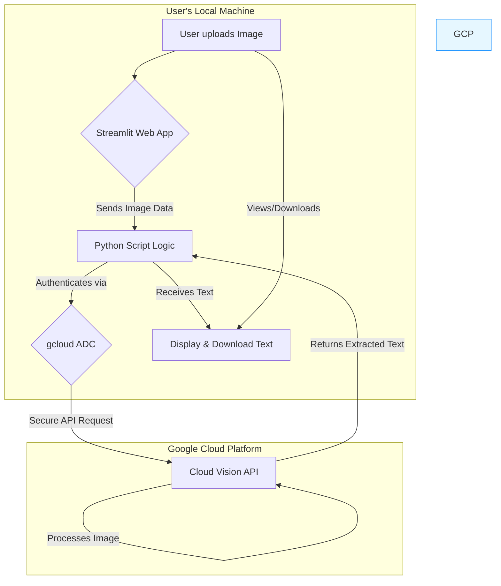

# GCP Vision OCR: Interactive OCR Text Extractor with Streamlit Interface 📄

[](https://cloud.google.com/vision)
[](https://streamlit.io/)
[](https://www.python.org/)
[](https://opensource.org/licenses/MIT)

## 📋 Project Overview

This project is an interactive web application built with Python and Streamlit that leverages the **Google Cloud Vision API** to perform Optical Character Recognition (OCR) and extract text from uploaded image files. It provides a user-friendly interface for a practical cloud AI service, demonstrating the ease of integrating powerful machine learning APIs into custom applications for document processing tasks.

The project includes both a command-line script for backend testing and a full-featured Streamlit web application for interactive use.

**(You should insert a screenshot or GIF of the Streamlit application in action here!)**
<!-- Example:  -->

## 🔄 Project Workflows

This project follows two distinct workflows: the development process to build the application and the functional process of how the finished application operates.

### Development Workflow

This diagram illustrates the structured, step-by-step process followed to build the project from scratch.



### Functional Workflow

This diagram shows how a user interacts with the final, running application and how data flows through the system.



## ⭐ Core Features

- **User-Friendly Interface**: Simple image uploader for PNG, JPG, and JPEG files.
- **Live OCR**: Triggers text extraction from the GCP Vision API with a single button click.
- **Interactive Results**: Displays the uploaded image and the full extracted text in a clean, scrollable text area.
- **Multiple Download Options**: Allows users to download the extracted text as a single .txt file or as a line-by-line .csv file.
- **Efficient Processing**: Uses Streamlit's caching (@st.cache_resource) to keep the GCP API client initialized for a responsive user experience.
- **Status Feedback**: Provides clear status messages using spinners and alerts during processing.

## 🛠️ Technology Stack

| Category | Technologies Used |
|----------|------------------|
| Cloud AI Service | Google Cloud Vision API (document_text_detection) |
| Web Framework | Streamlit |
| Core Language | Python 3.x |
| Key Libraries | google-cloud-vision, streamlit, pandas |
| Authentication | Google Cloud SDK (gcloud), Application Default Credentials (ADC) |
| Version Control | Git & GitHub |

## 📁 Project Structure

```
gcp-vision-ocr/
├── .git/
├── gcp1env/                 # Python virtual environment (in .gitignore)
├── sample_images/           # Directory for sample test images
│   └── receipt1.jpg
├── .gitignore
├── app_ocr.py               # The Streamlit web application script
├── ocr_tool.py              # The command-line Python script for core logic
├── requirements.txt         # Python package dependencies
└── README.md                # This file
```

## 🚀 Local Setup & Usage

### Prerequisites

- A Google Cloud Platform Account with an active project.
- The Cloud Vision API enabled within your GCP project.
- The Google Cloud SDK (gcloud CLI) installed and configured on your local machine.
- Crucially, you must be authenticated with Application Default Credentials:

```bash
gcloud auth application-default login
```

### Installation & Running the Web App

**Clone the Repository:**

```bash
git clone https://github.com/amirulhazym/gcp-vision-api-ocr.git
cd gcp-vision-api-ocr
```

**Set Up Virtual Environment:**

```bash
python -m venv gcp1env
.\gcp1env\Scripts\activate
```

**Install Dependencies:**

```bash
pip install -r requirements.txt
```

**Run the Streamlit Application:**

```bash
streamlit run app_ocr.py
```

The application will open in your web browser, typically at http://localhost:8501.

## 💡 Key Challenges & Learnings

- **Cloud Service Integration**: Successfully integrated a local Python application with a powerful cloud AI service, demonstrating the modern approach to leveraging pre-trained models.

- **Rapid Prototyping with Streamlit**: Realized the power of Streamlit for quickly building interactive and user-friendly interfaces for machine learning applications without needing traditional web development skills.

- **GCP Authentication**: Mastered the setup and use of gcloud and Application Default Credentials (ADC), a secure and standard method for local development against GCP services.

- **Real-World Problem Solving (Proxy Configuration)**: A key challenge was overcoming network connectivity errors due to a corporate proxy. This was resolved by correctly setting the HTTPS_PROXY environment variable, a critical troubleshooting skill for real-world development environments.

## 🔮 Future Enhancements

- **Deploy to the Cloud**: Containerize the application with Docker and deploy it to a service like Google Cloud Run for public access.
- **PDF Document Support**: Extend the functionality to handle multi-page PDF files, likely by integrating with GCS for asynchronous batch processing.
- **Structured Data Extraction**: Move beyond simple text extraction by exploring GCP's Document AI to parse specific fields (e.g., invoice totals, dates, line items) from structured documents like receipts and forms.

## 👤 Author

**Amirulhazym**
- LinkedIn: linkedin.com/in/amirulhazym
- GitHub: github.com/amirulhazym
- Portfolio: amirulhazym.framer.ai
